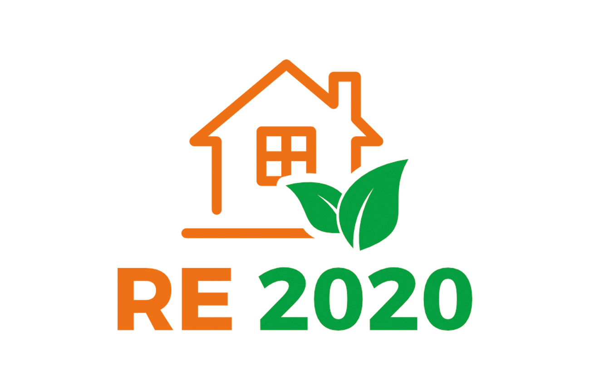
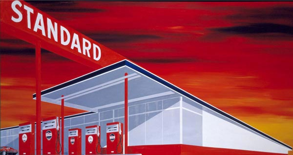

# Introduction

## Introduction


::: notes
La pollution industrielle commence dans les années XX. Elle fait des ravages, et transforme tout en noir.

-   Conséquences sur les gens : Statistics from the mid-19th century showed that urban industrial areas had significantly higher mortality rates than rural areas. In Manchester, for example, life expectancy for factory workers was around 17 years compared to 38 in rural districts. This data helped push for reforms to reduce pollution in cities.

In Hard Times (1854), Dickens vividly describes the industrial town of "Coketown," an allusion to Manchester, as blanketed in “smoke” and coated in a layer of soot. He writes of “serpents of smoke” and “blackened streets” that directly critique the environmental and social costs of rapid industrialization.

-   Conséquences sur les animaux : la phalène du bouleau
:::

## Introduction


::: notes
-   En Floride, en 2021, une installation minière a causé le déversement de l'équivalent d'un an de phosphores en 10 jours, causant des dégats majeurs sur l'écosystème, notamment des "red tides"
:::

# I. Les externalités

------------------------------------------------------------------------

::::: columns
::: {.column width="40%"}

:::

::: {.column width="60%"}
*"\[...\] one person A, in the course of rendering some service, for which payment is made, to a second person B, incidentally also renders services or disservices to other persons (not producers of like services), of such a sort that payment cannot be exacted from the benefited parties or compensation enforced on behalf of the injured parties"*

Arthur Cecil Pigou, *The Economics of Welfare*, 1920
:::
:::::

## Définitions

::: callout-tip
## Les externalités

Action d'un agent qui a des conséquences sur l'utilité ou le profit d'autres agents sans compensation monétaire

Le coût (ou bénéfice) **social** des actions diffère du coût (ou bénéfice) **privé**
:::

::: incremental
-   Un problème de justice
    -   Les gens n'ont rien demandé et sont lésés
-   Un problème d'efficacité :
    -   Nuit aux efforts que les gens font pour maximiser leur bien être
    -   Empêche le mécanisme de marché d'allouer les ressources au mieux
:::

------------------------------------------------------------------------

::: callout-note
## Le premier théorème de l'économie du bien-être

En présence d'information parfaite, si les droits de propriété sont proprement définis, l'équilibre de marché est optimal au sens de *Pareto* i.e. l'équilibre de marché mène à une allocation efficace, où l'on ne peut améliorer le bien être des uns sans détériorer celui des autres
:::

::: incremental
-   En présence d'externalités, les droits de propriétés sont mal définis:
    -   Il y a des droits sur les biens
    -   Mais pas sur les conséquences de beaucoup d'actions
    -   Le système de prix, qui guide l'allocation des ressources, ne reflète pas les bonnes informations
-   L'efficacité du système de marché est remise en cause : il faut agir pour restaurer l'équilibre du marché
:::

## Illustration des externalités

::: incremental
-   A titre d'exemple, supposons que qu'une entreprise produit des fertilisants, à un prix de 400 euros par unité de vente
-   Son coût marginal de production est de $Cm(q)=20q$
:::

::: fragment


::: {.cell}
::: {.cell-output-display}
{width=960}
:::
:::


:::

------------------------------------------------------------------------

::: {.incremental style="font-size:90%"}
-   A chaque unité produite, elle cause des pollutions locales
-   Ces pollutions locales ont des effets économiques *quantifiables* et *quantifiés* (on reviendra dessus dans l'heure suivante)
-   De sorte que le dommage marginal causé par les productions est $Md(q) = 100$
:::

::: fragment


::: {.cell}
::: {.cell-output-display}
{width=960}
:::
:::


:::

::: notes
-   Bien montrer que $Cm+Md=Social cost$
-   Que cela implique une réduction de la production, pour prendre en compte la pollution et le dommage qu'elle fait à l'écosystème
:::

## Solution réglementaire

::::: r-stack
::: fragment
{width="800"}
:::

::: fragment


::: {.cell}
::: {.cell-output-display}
{width=960}
:::
:::


:::
:::::

::: notes
On va avoir recours à différents types d'instruments

-   La norme : les normes ISO par exemple, qui limitent les rejets etc, sont obligatoires dans certains processus de production. RE 2020 est la nouvelle réglementation énergétique et environnementale de l’ensemble de la construction neuve. L’État, avec l’aide des acteurs du secteur, a lancé un projet inédit pour prendre en compte dans la réglementation non seulement les consommations d’énergie, mais aussi les émissions de carbone, y compris celles liées à la phase de construction du bâtiment. L’enjeu est donc de concevoir et construire les futurs lieux de vie des Français en poursuivant trois objectifs majeurs portés par le gouvernement :

un objectif de sobriété énergétique et une décarbonation de l’énergie ; une diminution de l’impact carbone ; une garantie de confort en cas de forte chaleur.
:::

## Les solutions monétaires

::: {.fragment style="font-size:90%"}
-   L'approche **pigouvienne**
    -   Pollueur-payeur
    -   Taxe (ou subvention) du montant du dommage marginal
:::

::: fragment
$$\begin{align}
\Pi &= (p-t)q-c(q)\\
    & (p-t) = Cm(q)\\
    & p = Cm(q)+Md(q)
\end{align}$$
:::

::: {.incremental style="font-size:90%"}
-   Double dividende :
    -   Incitation à réduire : moins de dommage
    -   Recette fiscale
:::

## Solution monétaire

:::::: r-stack
::: fragment


::: {.cell}
::: {.cell-output-display}
{width=960}
:::
:::


:::

::: fragment


::: {.cell}
::: {.cell-output-display}
{width=960}
:::
:::


:::

::: fragment


::: {.cell}
::: {.cell-output-display}
{width=960}
:::
:::


:::
::::::

## Solution monétaire

::: fragment
{width="800"}
:::

::: notes
La taxe : en France, on a la TICPE (taxe intérieure sur la consommation des produits énergétiques) - 28 milliards d'euros en 2016, de loin la plus grosse fiscalité environnementale
:::

## Les solutions monétaires

::: incremental
-   L'approche **coasienne** :
    -   *"Dans un monde où les coûts de transaction sont nuls, l'allocation des droits de propriété aboutit à une allocation efficiente des ressources"*
    -   Idée : donner des droits de propriété (sur l'air propre par exemple), et demander aux entreprises de l'acheter
    -   A partir de ce moment là, on peut aboutir à un équilibre efficace
:::

::: fragment
$$\begin{align}
\Pi &= pq - CT(q) - (p^Dq)\\
    &= (p - p^D q) - CT(q)
\end{align}$$
:::

## Les solutions monétaires

::: fragment
{width="800"}
:::

::: notes
-   Les droits à polluer :
    -   EU ETS, depuis 2005, plusieurs vagues d'élargissement, seuls certains secteurs comme la production d'énergie et l'industrie lourde étaient inclus. Avec le temps, d'autres secteurs, comme l'aviation intra-européenne, ont été intégrés. Cependant, le transport routier et l’agriculture en sont encore exclus.
    -   Plus ambitieuse, cette phase voit une réduction plus rapide du plafond et un renforcement des mécanismes de stabilisation, avec des prix atteignant des niveaux record, autour de 80-90 € la tonne en 2023.
    -   Réduction des Émissions : L'EU-ETS a contribué à une réduction des émissions dans les secteurs couverts, avec une diminution de près de 35 % depuis 2005.
    -   Efficacité Économique : Ce système incite les entreprises à investir dans des technologies plus propres et à réduire leurs émissions de manière économiquement efficace. Cependant, il a été critiqué pour ses périodes d'excédent de quotas, qui ont limité l'incitation à réduire les émissions.
:::

## Conclusion

::: {.incremental style="font-size:90%"}
-   Les solutions basées sur les taxes requièrent :
    -   L'intervention de l'état
    -   La connaissance des dommages marginaux
-   Celles basées sur le marché :
    -   Fonctionnent lorsque les coûts de transaction sont faibles
    -   Requièrent moins d'information
    -   Mais nécessitent un très bon design de marché
:::

[En cas d'incertitudes sur les dommages et coûts de dépolution]{.fragment}

::: {.incremental style="font-size:90%"}
-   Si on s'attend à ce que les dommages explosent plus vite, et que l'incertitude qui les entoure est plus grande que les coûts : les **normes** sont mieux
-   Si l'on a une plus grande incertitude sur les coûts, qu'ils augmentent plus vite, il vaut mieux utiliser des **solutions monétaires**
:::

::: notes
If there is greater uncertainty in the marginal costs of abatement and the marginal damages are relatively flat (i.e., damages don't change as dramatically with each unit of pollution), price-based policies like taxes or fees are more efficient. A pollution tax provides a predictable cost for each unit of pollution, allowing firms to adjust their emissions according to their abatement costs without risking over- or under-shooting the optimal level of emissions.
:::

# II. Les biens publics

## Définition

::: callout-tip
## Les biens communs et publics

Les **biens communs** sont des biens dont il est difficile *d'exclure* des individus de la consommation, mais qui ont une *rivalité* forte

Les *biens publics* sont des biens dont il est difficile *d'exclure* des individus de la consommation, mais qui ont une *rivalité* faible
:::

::: fragment


::: {.cell}
::: {.cell-output-display}

`````{=html}
<table class="table table-striped table-hover table-condensed" style="margin-left: auto; margin-right: auto;">
 <thead>
  <tr>
   <th style="text-align:left;">  </th>
   <th style="text-align:left;"> Rivalité </th>
   <th style="text-align:left;"> Non-Rivalité </th>
  </tr>
 </thead>
<tbody>
  <tr>
   <td style="text-align:left;"> Non-Excluable </td>
   <td style="text-align:left;">  </td>
   <td style="text-align:left;">  </td>
  </tr>
  <tr>
   <td style="text-align:left;"> Excluable </td>
   <td style="text-align:left;">  </td>
   <td style="text-align:left;">  </td>
  </tr>
</tbody>
</table>

`````

:::
:::


:::

## Définition

::: callout-tip
## Les biens communs et publics

Les **biens communs** sont des biens dont il est difficile *d'exclure* des individus de la consommation, mais qui ont une *rivalité* forte

Les *biens publics* sont des biens dont il est difficile *d'exclure* des individus de la consommation, mais qui ont une *rivalité* faible
:::


::: {.cell}
::: {.cell-output-display}

`````{=html}
<table class="table table-striped table-hover table-condensed" style="margin-left: auto; margin-right: auto;">
 <thead>
  <tr>
   <th style="text-align:left;">  </th>
   <th style="text-align:left;"> Rivalité </th>
   <th style="text-align:left;"> Non-Rivalité </th>
  </tr>
 </thead>
<tbody>
  <tr>
   <td style="text-align:left;"> Excluable </td>
   <td style="text-align:left;"> Biens Privés </td>
   <td style="text-align:left;"> Biens de Club </td>
  </tr>
  <tr>
   <td style="text-align:left;"> Non-Excluable </td>
   <td style="text-align:left;"> Biens Communs </td>
   <td style="text-align:left;"> Biens Publics </td>
  </tr>
</tbody>
</table>

`````

:::
:::


## Définition

::: callout-tip
## Les biens communs et publics

Les **biens communs** sont des biens dont il est difficile *d'exclure* des individus de la consommation, mais qui ont une *rivalité* forte

Les *biens publics* sont des biens dont il est difficile *d'exclure* des individus de la consommation, mais qui ont une *rivalité* faible
:::


::: {.cell}
::: {.cell-output-display}

`````{=html}
<table class="table table-striped table-hover table-condensed" style="margin-left: auto; margin-right: auto;">
 <thead>
  <tr>
   <th style="text-align:left;">  </th>
   <th style="text-align:left;"> Rivalité </th>
   <th style="text-align:left;"> Non-Rivalité </th>
  </tr>
 </thead>
<tbody>
  <tr>
   <td style="text-align:left;"> Excluable </td>
   <td style="text-align:left;"> Biens Privés (ex. nourriture, vêtements) </td>
   <td style="text-align:left;"> Biens de Club (ex. cinéma, abonnement) </td>
  </tr>
  <tr>
   <td style="text-align:left;"> Non-Excluable </td>
   <td style="text-align:left;"> Biens Communs (ex. ressources naturelles) </td>
   <td style="text-align:left;"> Biens Publics (ex. sécurité, lumière publique) </td>
  </tr>
</tbody>
</table>

`````

:::
:::


## Biens communs - quel est le problème?

::: incremental
-   La faible **excludabilité** d'un bien veut dire qu'il y a peu ou pas de droits de propriété dessus
:::

:::: fragment
::: callout-note
## La tragédie des communs

*The tragedy of commons* est une fable économique de Garett Hardin, biologiste de l'université de Santa Barbara

L'idée est la suivante : supposez un pré, où peuvent paître les vaches, qui appartient à une communauté. Le pré s'abîme à mesure qu'on y va. Sachant que les autres membres de la communauté risquent de l'utiliser avant vous, que se passe-t-il?
:::
::::

::::::: r-stack
::: fragment


::: {.cell}
::: {.cell-output-display}

`````{=html}
<table class="table" style="width: auto !important; margin-left: auto; margin-right: auto;">
 <thead>
  <tr>
   <th style="text-align:left;">   </th>
   <th style="text-align:left;"> Pâturer modérément </th>
   <th style="text-align:left;"> Pâturer beaucoup </th>
  </tr>
 </thead>
<tbody>
  <tr>
   <td style="text-align:left;"> Pâturer modérément </td>
   <td style="text-align:left;"> 3, 3 </td>
   <td style="text-align:left;"> 0, 4 </td>
  </tr>
  <tr>
   <td style="text-align:left;"> Pâturer beaucoup </td>
   <td style="text-align:left;"> 4, 0 </td>
   <td style="text-align:left;"> 1, 1 </td>
  </tr>
</tbody>
</table>

`````

:::
:::


:::

::: fragment


::: {.cell}
::: {.cell-output-display}

`````{=html}
<table class="table" style="width: auto !important; margin-left: auto; margin-right: auto;">
 <thead>
  <tr>
   <th style="text-align:left;">   </th>
   <th style="text-align:left;"> Pâturer modérément </th>
   <th style="text-align:left;"> Pâturer beaucoup </th>
  </tr>
 </thead>
<tbody>
  <tr>
   <td style="text-align:left;"> Pâturer modérément </td>
   <td style="text-align:left;"> 3, 3 </td>
   <td style="text-align:left;"> 0, 4 </td>
  </tr>
  <tr>
   <td style="text-align:left;font-weight: bold;color: blue !important;"> Pâturer beaucoup </td>
   <td style="text-align:left;font-weight: bold;color: blue !important;"> 4, 0 </td>
   <td style="text-align:left;font-weight: bold;color: blue !important;"> 1, 1 </td>
  </tr>
</tbody>
</table>

`````

:::
:::


:::

::: fragment


::: {.cell}
::: {.cell-output-display}

`````{=html}
<table class="table" style="width: auto !important; margin-left: auto; margin-right: auto;">
 <thead>
  <tr>
   <th style="text-align:left;">   </th>
   <th style="text-align:left;"> Pâturer modérément </th>
   <th style="text-align:left;"> Pâturer beaucoup </th>
  </tr>
 </thead>
<tbody>
  <tr>
   <td style="text-align:left;"> Pâturer modérément </td>
   <td style="text-align:left;"> 3, 3 </td>
   <td style="text-align:left;font-weight: bold;color: blue !important;"> 0, 4 </td>
  </tr>
  <tr>
   <td style="text-align:left;"> Pâturer beaucoup </td>
   <td style="text-align:left;"> 4, 0 </td>
   <td style="text-align:left;font-weight: bold;color: blue !important;"> 1, 1 </td>
  </tr>
</tbody>
</table>

`````

:::
:::


:::

::: fragment


::: {.cell}
::: {.cell-output-display}

`````{=html}
<table class="table" style="width: auto !important; margin-left: auto; margin-right: auto;">
 <thead>
  <tr>
   <th style="text-align:left;">   </th>
   <th style="text-align:left;"> Pâturer modérément </th>
   <th style="text-align:left;"> Pâturer beaucoup </th>
  </tr>
 </thead>
<tbody>
  <tr>
   <td style="text-align:left;"> Pâturer modérément </td>
   <td style="text-align:left;"> 3, 3 </td>
   <td style="text-align:left;"> 0, 4 </td>
  </tr>
  <tr>
   <td style="text-align:left;"> Pâturer beaucoup </td>
   <td style="text-align:left;"> 4, 0 </td>
   <td style="text-align:left;"> <span style="     color: white !important;border-radius: 4px; padding-right: 4px; padding-left: 4px; background-color: blue !important;">1, 1</span> </td>
  </tr>
</tbody>
</table>

`````

:::
:::


:::
:::::::

## Biens communs - quel est le problème?

::: incremental
-   On peut mettre des droits de propriétés, pas forcément individuels
-   Les travaux de *E.Oström* montrent bien cela : la gestion communautaire marche parfois très bien
    -   Gestion traditionelle des pâtures en Suisse par exemple
    -   Il y a des limites strictes sur les têtes de bétail
    -   Des efforts partagés pour les chemins et clôtures
    -   Des mécanismes de détermination et résolution de conflit
:::

## Les biens publics

::: incremental
-   Selon la même idée qu'Hardin, la fourniture de biens communs souffrirait de *passagers clandestins*
-   La fourniture optimale de biens publics doit être telle que :
    -   La somme des dispositions à payer pour le bien public des gens (somme des taux marginaux de substitution entre bien public et privé)
    -   Egale le coût marginal de production
    -   C'est la règle de *Bowen-Lindahl-Samuelson*
:::

[Super mais comment?]{.fragment}

## Les biens publics

::: {.incremental style="font-size:85%"}
-   La contribution *à la Lindahl* : chacun contribue à hauteur de sa disposition à payer
-   Mais difficile à mettre en place:
    -   Suppose la connaissance des informations
    -   Et la révélation *juste* : intérêt à sous-déclarer son envie
-   Des mécanismes qui doivent être *incentive compatible* sont dévelopés comme: [Mécanisme de Vickrey - Clark - Groves](https://en.wikipedia.org/wiki/Vickrey%E2%80%93Clarke%E2%80%93Groves_auction)
    -   Vickrey : paie le second plus haut prix (plus d'intérêt à sous déclarer)
    -   Clarke : on paie ce qui gêne les autre, ce qui les empêche d'être à leur optimum
-   Fonctionnement global :
    -   On fait la moyenne des enchères
    -   On fait payer à chacun la différence entre ce qu'il est prêt à payer et le prix moyen
-   Pas tellement mis en place: c'est très compliqué
-   On a rarement *l'optimalité* de la fourniture des biens publics
:::

# Conclusion

::: incremental
-   Les **externalités** :
    -   Sont le résultat d'activités sur les profits/utilités d'autres agents sans compensation monétaire
    -   Elles émergent car le *coût privé* des actions diffère du *coût social*
    -   Leur régulation implique (i) de fixer les quantités ou (ii) de faire internaliser la différence aux acteurs
-   Les **biens communs et publics**:
    -   Sont non excludables et faiblement rivaux
    -   Risquent de poser des problèmes de *passager clandestin*
    -   Mais des mécanismes de régulation, par la propriété, ou par l'élicitation des préférences, permettent d'améliorer la situation
:::
